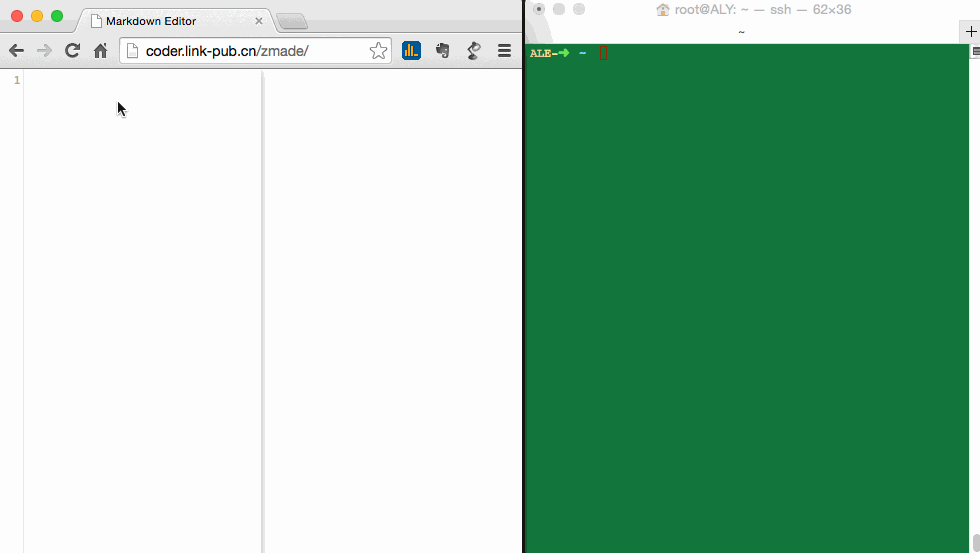
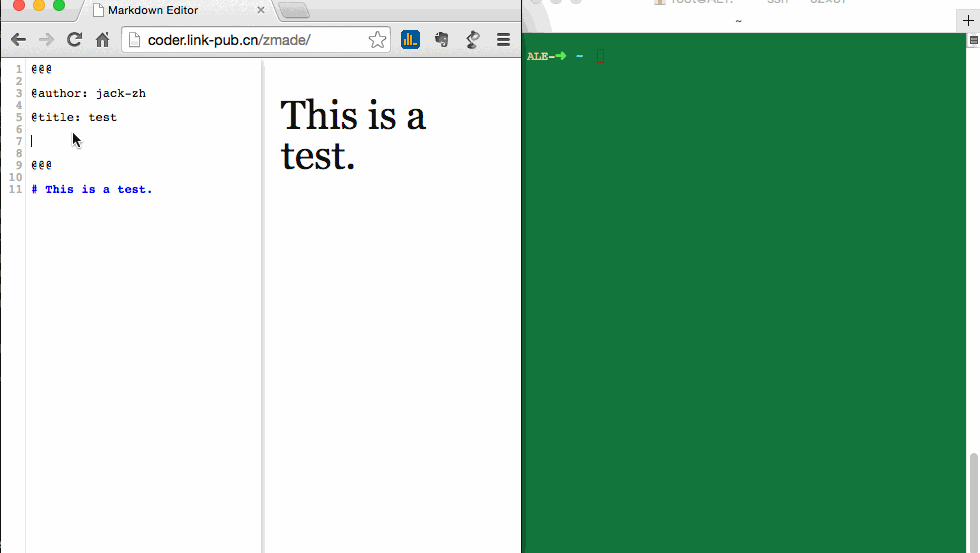
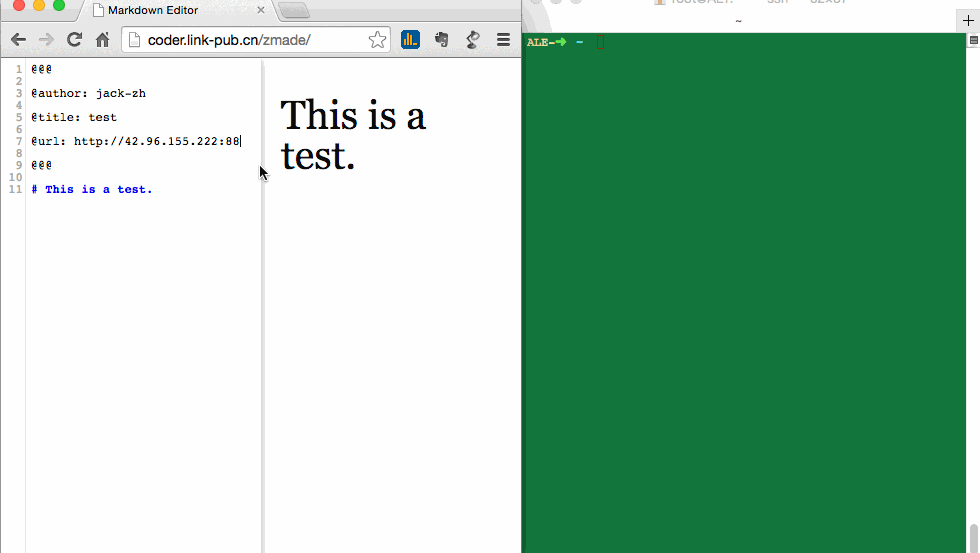

# This is zMarkDown Editor

### 1. This is:

  + Power by [markdown-editor](https://github.com/jbt/markdown-editor)
  + Simplification
  + `Ctrl + S` will post the code to url which you set in header
  + `Ctrl + B` show all attachments
  + `Ctrl + Delete` clear localStorage
  + Between `@@@` is set message
    + url: post url
    + other: argument set

### 2. Argument example:


```
@@@
 
@author:jack.zh

@title:Readme title

@target:markdown

@floder:editor

@url:http://example.com/newblog

@publish:true

@@@
```

The post code whill be(use JSONP and callback=jsonpcallback):

```javascript
$.ajax({
  url: "http://example.com/newblog",
  dataType: 'jsonp',
  jsonp: "jsonpcallback",
  data: data,
  async: false
});
```
data:
```javascript
{
  author: "jack.zh", 
  title: "Readme title", 
  target: "markdown", 
  floder:"editor", 
  publish: "true",
  makedown_str: "...", // without @@@ plus
  code: "..." // all edit code
}

```

### 3. Show-how

##### 1. edit markdown



##### 2. set url and started server



##### 3. Save show(keycode: `Ctrl + S`)




### 4. Markdown Example:

code style:

```go

package main

import "fmt"

func main() {
    fmt.Println("Hello, 世界")
}

```

table:


| Item      |    Value | Qty  |
| :-------- | --------:| :--: |
| Computer  | 1600 USD |  5   |
| Phone     |   12 USD |  12  |
| Pipe      |    1 USD | 234  |


Enjoy it!   
      